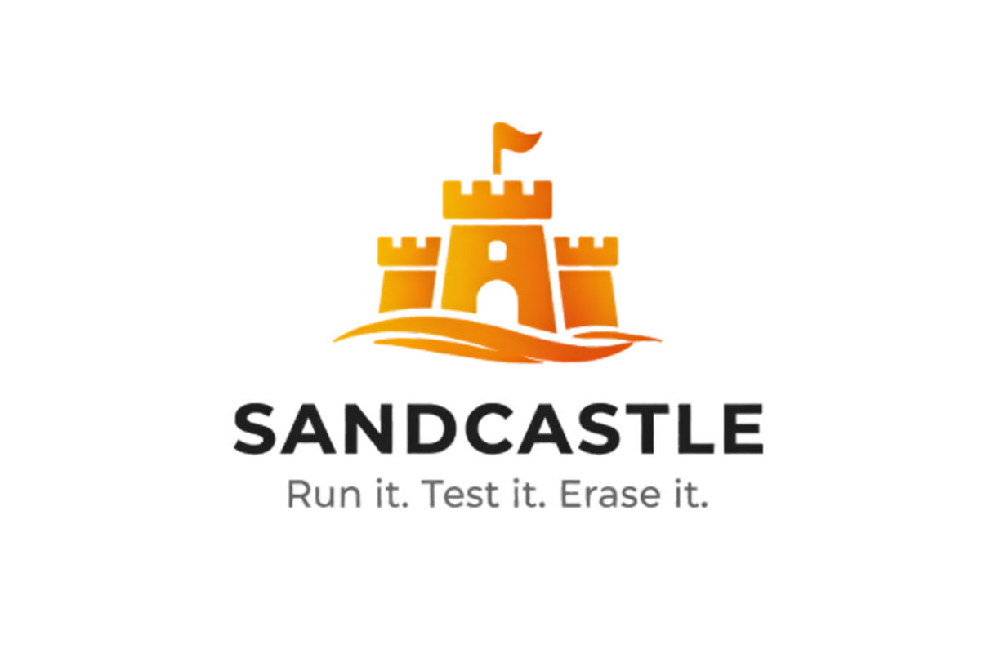

  

# Sandcastle

Run it. Test it. Erase it.

Disposable AWS workspaces for interviews, workshops, and live coding.

**Sandcastle** provisions **temporary EC2 workspaces** on AWS: **code-server** (VS Code in the browser) behind **NGINX**, an **Application Load Balancer**, and **CloudFront**, with **automatic teardown** when the window ends. Built for interviews, talks, live code-alongs, and classrooms, anywhere people need a shared, browser-based IDE with a known baseline.

## Why this exists

Live sessions often need a **consistent, isolated workspace** where people can write and run code without sharing your production network or accounts. **Sandcastle** solves that by:

- **Provisioning on demand** via **AWS CDK (TypeScript)** so you get repeatable infrastructure as code.
- **Browser-based IDE access** through CloudFront, so candidates only need a URL and password; no VPN or local toolchain required for the host side.
- **Bounded lifetime**: a scheduled stack deletion at a configured UTC time reduces the risk of forgotten instances and long-lived attack surface.
- **Separation of concerns**: session materials and assets live in the **`interview/`** workspace bundle directory (for example a Dockerized Jupyter stack and starter notebooks), while **`infra/`** owns AWS networking, compute, and delivery.

Use a **dedicated, non-sensitive AWS account** for these stacks. Do not deploy into production or shared accounts. Details are in the security documentation linked below.

## What is in the repo

| Area | Purpose |
|------|---------|
| **`infra/`** | CDK app: VPC, EC2, ALB, CloudFront, S3 for the workspace bundle zip, termination Lambda, etc. |
| **`interview/`** | **Workspace bundle** source: zipped and uploaded for instances to download on first boot, including exercises, repos, notebooks, Dockerfiles, etc. (see below). |
| **`docs/`** | Operator guides: deploy steps, architecture, security, operations, troubleshooting. |

## What you can put in `interview/`

The `interview/` directory is whatever you want candidates or participants to work with after the instance boots: starter repos, README instructions, data files, notebooks, tests, and tooling hints. It is packaged by CDK, stored in S3, and unpacked on the instance under the ubuntu user. See [Workspace bundle](docs/getting-started.md#workspace-bundle).

**Runtime on the instance (today’s stack):** user-data in [`infra/scripts/bootstrap-base.sh`](infra/scripts/bootstrap-base.sh) installs **Node.js** (current LTS line via NodeSource) and **Docker** (with the `ubuntu` user in the `docker` group), so participants can run `node` / `npm` and `docker` out of the box.

**Going further:**

- **Extend the AMI/bootstrap**: You can add packages or installers in that script (or related CDK user-data) so the host has extra toolchains, for example **Go**, **Rust**, **.NET / C#**, JVM languages, or whatever your session needs. That keeps everything on the bare instance and visible from code-server.
- **Use a Dockerfile instead**: Put a **Dockerfile** (and supporting files) in `interview/` and have people **build and run a container** as their dev environment (for example a Jupyter or ML image). That pattern works well when you want a fully reproducible stack without bloating the host AMI. The sample under `interview/` includes a Dockerfile with build/run notes for local use; the same bundle is what deploys to EC2.

For a quick local loop without AWS, follow the comments in `interview/Dockerfile`.

## Getting started

1. **Read the overview**: [Documentation index](docs/index.md) lists all guides and where code lives.
2. **Deploy an environment**: [Getting started](docs/getting-started.md) covers prerequisites, `infra/config.ts`, `npx cdk bootstrap`, and `npx cdk deploy`, plus how the workspace bundle lands in S3 and on the instance.
3. **Tune code-server**: [Configuring code-server](docs/code-server.md) explains fleet fields (password, workspace, extensions) and why extensions use **Open VSX**.
4. **Understand the system**: [Architecture](docs/architecture.md) describes what is deployed and the browser → CloudFront → ALB → code-server path.
5. **Run safely**: [Security](docs/security.md) and the [Security officer briefing](docs/security-officer-briefing.md) cover threat model, controls, and account choice.
6. **Day-two operations**: [Operations](docs/operations.md) for redeploys and teardown; [Troubleshooting](docs/troubleshooting.md) when something fails.

---

**Documentation:** [index](docs/index.md) · [Getting started](docs/getting-started.md) · [Configuring code-server](docs/code-server.md) · [Architecture](docs/architecture.md) · [Security](docs/security.md) · [Security officer briefing](docs/security-officer-briefing.md) · [Operations](docs/operations.md) · [Troubleshooting](docs/troubleshooting.md)
