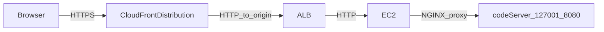

# Security

## Scope and intended use

This repository provisions a **temporary, disposable interview environment** in AWS: an EC2 instance running `code-server` (VS Code in the browser) behind NGINX, an internet-facing ALB, and CloudFront, with automated teardown.

**Critical warning**:

- **This MUST NOT be deployed in any sensitive AWS account.** Do not deploy into production, shared, regulated, security accounts, or any account with real data or meaningful IAM/users/roles.
- **Best practice is a fresh AWS account** with nothing deployed or configured in it (beyond what CDK bootstrap creates), used only for this environment, then discarded.

**Rationale**: this stack intentionally creates a public entrypoint (CloudFront), provisions interactive compute, uses password authentication, installs third-party software via network fetches at boot, and exports operational logs. These are acceptable trade-offs for an ephemeral sandbox. They are not acceptable in accounts with significant blast radius.

## Architecture summary and trust boundaries

### Request flow

### Trust boundaries

- **Public internet boundary**: the CloudFront distribution is internet-accessible.
- **CDN/edge boundary**: CloudFront terminates viewer TLS and forwards to the origin.
- **Load balancer boundary**: the ALB receives traffic only intended to be from CloudFront.
- **Origin boundary**: EC2 runs NGINX and `code-server`; host compromise is compromise of the environment.
- **AWS account boundary**: the largest risk is account blast radius. This is why the fresh account only requirement exists.

### If the host is compromised, what does the attacker get?

Compromise of the interview host **does not automatically grant broad access to your AWS account**. For example, it does not grant the ability to enumerate or modify arbitrary AWS resources.

However, a compromised host **can use whatever AWS permissions and network access are available to that instance**. In this repo, the EC2 instance role is designed to keep that blast radius narrow (for example, scoped S3 reads for the bundle object key, scoped CloudWatch Logs writes, and SSM management), but it is **not zero**.

So in practical terms, the blast radius is **the interview environment itself plus the limited AWS access granted to the EC2 instance role**. That is why deploying into a fresh, non-sensitive account is still required.

## Threat model

### Assets (what you should assume could be harmed)

- **Interactive session**: whatever the candidate/interviewer can access in the IDE/terminal.
- **Instance filesystem**: bundle contents, any files created during the session, and OS state.
- **S3 bundle object**: the interview bundle zip the instance downloads.
- **CloudFront access logs**: request metadata for the public endpoint.
- **CloudWatch logs**: boot logs and NGINX error logs (and anything those logs capture).
- **AWS account resources**: any impact reachable from the instance's IAM role and network egress.

### Adversaries (realistic attacker types)

- **Internet attacker**: probing the CloudFront endpoint.
- **Credential thief**: obtains the `code-server` password (phishing, reuse, shoulder-surf, log leakage).
- **Compromised client**: interviewer/candidate device is compromised and steals credentials/session.
- **Supply-chain attacker**: compromises third-party install scripts or upstream package repos used at boot.
- **Malicious or compromised bundle**: bundle contains unwanted binaries/scripts or prompts the user to run unsafe commands.

### Entry points

- CloudFront distribution (public).
- Origin request path through ALB → NGINX → `code-server`.
- Boot-time network fetches (installer scripts, package repos).
- Outbound network access from the instance (HTTP/HTTPS).

## Threat matrix

Qualitative ratings are relative to this project's intended use (short-lived, disposable sandbox). They assume the environment is deployed as designed (CloudFront in front, origin header enforcement, and a deliberately narrow instance role), and that it is still exposed to the public internet via CloudFront.

| Threat type | Impact (if it happens) | Likelihood | Notes / what limits it |
|---|---:|---:|---|
| **Credential theft (code-server password obtained)** | **High**: attacker gains interactive IDE + shell access to the environment | **Medium** | Password-only auth; mitigated primarily by strong unique password, short lifetime, and fresh account isolation |
| **Brute force / credential stuffing** | **High**: same as above if successful | **Low to Medium** | CloudFront plus WAF at the ALB (if enabled) can reduce volumetric attacks; this is still a public endpoint; rate limiting is not a substitute for strong auth |
| **Software vulnerability in `code-server` / NGINX / OS** | **High**: remote code execution or auth bypass → host compromise | **Medium** | Reduced exposure vs direct instance by CloudFront-only ingress path + secret origin header, but attacker targets the public service |
| **Origin bypass (direct access to ALB/instance)** | **Medium to High**: bypass CloudFront controls, reach origin path directly | **Low** | ALB SG allows inbound only from the CloudFront origin-facing prefix list; instance SG only from ALB; NGINX requires the secret origin header |
| **Supply-chain compromise at boot (remote install scripts / package repos)** | **High**: compromised host from first boot | **Low to Medium** | Convenience-driven; mitigated mainly by ephemerality and not using sensitive accounts/data; not a high-assurance posture |
| **Malicious interview bundle content** | **Medium to High**: environment compromise, data exfil from session, persistence in that host | **Medium** | Bundle is trusted input; mitigate by keeping bundle minimal, reviewing contents, and treating the host as untrusted |
| **Instance IAM role abuse after host compromise** | **Low to Medium**: limited AWS API actions (scoped S3 reads, scoped logs writes, SSM) | **Low** | Role is intentionally narrow; host compromise can still use whatever permissions exist |
| **Sensitive data leakage via logs** | **Medium**: credentials or secrets accidentally captured in logs | **Medium** | CloudWatch agent ships boot/NGINX logs; mitigate by not using real secrets/data and keeping sessions clean |
| **Denial of service (flooding the endpoint)** | **Low to Medium**: environment becomes unusable | **Medium** | Public endpoint; WAF and rate limiting can help; disposal means you can recreate quickly |

## Implemented security controls (grounded in this repo)

This section lists controls implemented in this repository today.

### Network controls

- **CloudFront-only reachability to the origin path**:
  - The **ALB security group** allows inbound TCP/80 only from AWS's CloudFront *origin-facing* managed prefix list.
  - The **instance security group** allows inbound TCP/80 only from the ALB security group.
- **`code-server` bound to localhost**:
  - `code-server` listens only on `127.0.0.1:8080`, preventing direct network exposure of the IDE service.
- **CloudFront baseline controls**:
  - Viewer requests are redirected to HTTPS.
  - A modern minimum TLS policy is enforced.
  - Standard CloudFront access logs are enabled and delivered to S3 with an expiration lifecycle.
- **WAF is attached at the ALB (REGIONAL)**:
  - If configured, a REGIONAL WAF WebACL is associated to the ALB.
  - Note: CloudFront-scope WAF is not attached by this stack.

### IAM controls (blast-radius reduction)

The EC2 instance role is intentionally narrow to reduce AWS API blast radius if the instance is compromised:

- **S3 read is scoped**:
  - `s3:GetObject` is granted only for the configured bundle object key (`projectZipKey`).
  - `s3:ListBucket` is constrained by an `s3:prefix` condition matching that key/prefix.
- **CloudWatch Logs write is scoped**:
  - Permissions are limited to the per-environment log group and its streams.
- **SSM management access is enabled**:
  - The instance role attaches the AWS-managed policy `AmazonSSMManagedInstanceCore`.

These controls reduce AWS API blast radius, but they do not prevent damage inside the compromised host (processes, filesystem, user sessions).

### Data protection controls

- **EBS encryption at rest**: the root EBS volume is encrypted and configured to delete on termination.
- **S3 bucket is private and TLS-enforced**:
  - Public access is blocked and SSL is enforced.
  - The bucket is configured for stack teardown (destroy + auto-delete).
- **Short default retention for diagnostics**: per-environment CloudWatch log group retention is one week (to support debugging while limiting long-term persistence).

### Lifecycle controls (time-bounding)

- **Automated teardown**: an EventBridge rule triggers a Lambda that calls CloudFormation `DeleteStack`.
- **Termination date parsing and enforcement**:
  - `terminationDateUtc` must be valid ISO 8601 UTC and end in `Z`.
  - The stack refuses to create environments with termination dates more than 365 days into the future.

## Residual risks and explicit non-goals

This project intentionally does **not** attempt to meet high-assurance security requirements. Known residual risks/non-goals include:

- **Not for sensitive accounts or data**: the primary mitigation is **account isolation** (fresh account only).
- **Password-only auth**: `code-server` uses password authentication (no MFA/SSO).
- **Public entrypoint**: CloudFront is internet-accessible.
- **Supply-chain exposure at boot**: packages and installer scripts are downloaded during first boot (for convenience).
- **Logs can contain sensitive material**: do not paste secrets into terminals or files.
- **CloudFront → ALB uses HTTP**: the origin hop is HTTP; confidentiality/integrity on that hop is not provided by TLS.

## Operational best practices

- **Use a fresh account** with nothing else deployed/configured.
- **Set a strong, unique `codeServerPassword`** and rotate it for each interview session.
- **Set an aggressive `terminationDateUtc`** and delete the stack manually as soon as you are done.
- **Treat the environment as untrusted**: do not upload credentials, private keys, customer data, or internal source code.

## Incident response (minimal runbook)

Given the design goal of disposability, the safest response is usually to **delete and recreate**.

- **Containment**
  - Delete the CloudFormation stack immediately (fastest way to remove the public entrypoint and compute).
  - If deletion is blocked, restrict the CloudFront distribution behavior (or disable) as a temporary stopgap.
- **Recovery**
  - Redeploy a fresh environment (new instance and CloudFront distribution).
  - Rotate the `codeServerPassword`.
- **Evidence considerations**
  - If you need to preserve evidence, export/preserve relevant CloudWatch logs before stack deletion.
  - Note the stack is configured to destroy resources on teardown; long-lived forensic artifacts are not retained by design.

